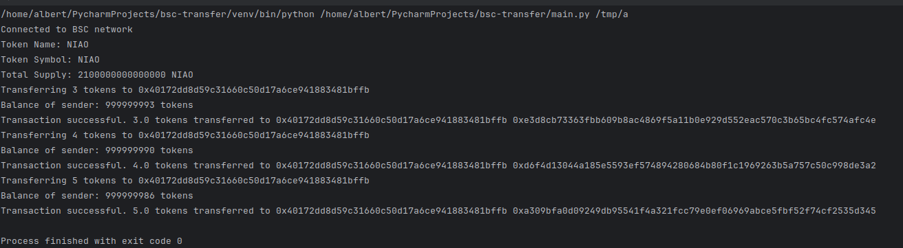
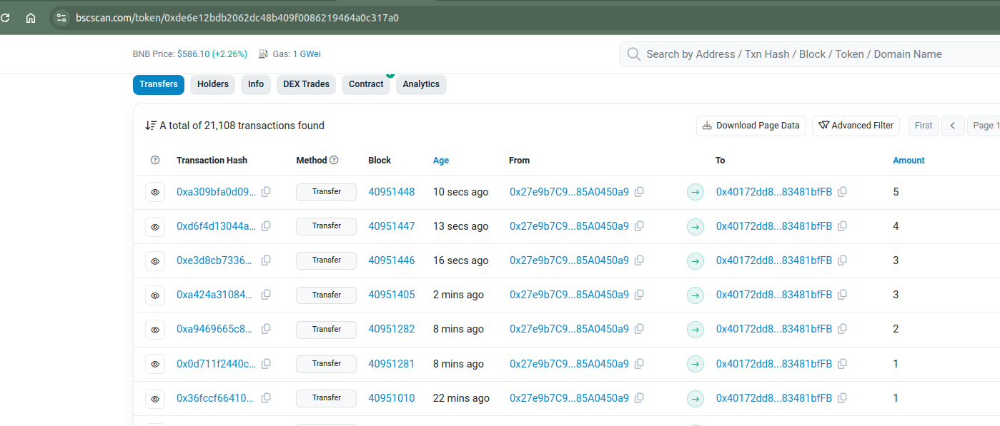

# 为什么要写这个项目

为了方便鸟币的空投, 手动空投太麻烦了, 于是写了这个项目, 用来批量空投鸟币
只需要编写一个配置文件, 然后运行程序, 就可以批量空投鸟币了


## 使用说明

### 1. 安装依赖
```shell
python3 -m venv venv
source v/bin/activate
pip install -r requirements.txt
```

### 2. 修改配置文件

1. `cp private.sample private.py`
2. 在  private.py 文件中更新你的钱包地址和私钥

    ```python
    from_address = 'xxx'
    private_key = 'xxx'
    ```

### 3. 填写转帐信息

每一行第一段为地址, 第二段为数量, 用 ',' 分隔

```
0x40172dd8d59c31660c50d17a6ce941883481bffb,3
0x40172dd8d59c31660c50d17a6ce941883481bffb,4
0x40172dd8d59c31660c50d17a6ce941883481bffb,5
```
### 4. 运行程序

```shell
python main.py /path/to/txt_file
```

## 运行效果截图





## 附录
- 
- 鸟币合约地址: 0xde6e12bdb2062dc48b409f0086219464a0c317a0 
- 鸟币官网  https://niaocoin.xyz/
- 鸟币 tg 群 https://t.me/NIAOCOIN


## 特别鸣谢


### bsc 转帐核心代码
https://github.com/CodeWithJoe2020/sendTransactionsonBSC/blob/main/send.py

### 运行时报错分析
https://claude.ai